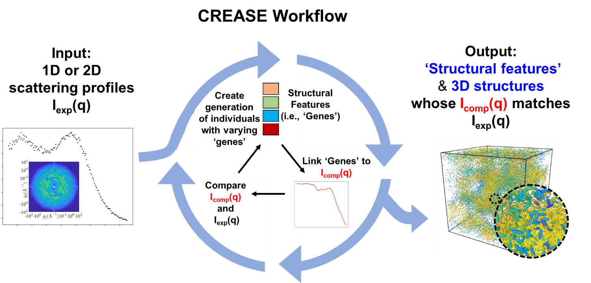
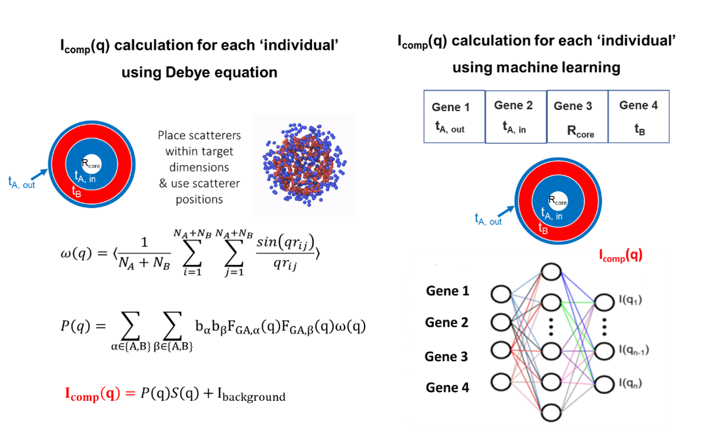

CREASE Overview
===============

1. Introduction to CREASE
-------------------------

Members of Prof. Arthi Jayaraman’s research lab have developed the **‘Computational Reverse-Engineering Analysis for Scattering Experiments’ (CREASE)** method to address these needs for alternate scattering analysis methods that are applicable to both conventional soft materials structures with existing analytical models and unconventional structures/chemistries that may not have good analytical models.

   Figure 1.: CREASE workflow. CREASE takes as input experimentally measured 1D scattering profiles and identifies as output the key structural features as well as representative 3D real space structures whose computed scattering profiles matches the experimental scattering input.  

**Figure 1** shows the general workflow in CREASE where experimentally measured 1D scattering profiles are taken as input and CREASE, through an internal optimization, generates as output the key structural features as well as representative 3D real space structures whose computed scattering profiles match the experimental scattering input. If you are interested in this method, you may wish to watch Prof. Jayaraman's recently recorded lecture on CREASE and its uses. The lecture can be found in this `link <https://www.youtube.com/watch?v=EInaEmeo9Dg>`_. 

In March 2024, the CREASE method was extended and made available as `CREASE-2D <https://github.com/arthijayaraman-lab/CREASE-2D>`_. This method works directly with experimentally measured 2D scattering profiles and outputs the 3D real space structures which can additionally have structural anisotropy (described further in Section 6).

2.	Guiding Philosophy
--------------------------

CREASE’s workflow is based on the **philosophy** that the real-space three-dimensional (amorphous) arrangement of constituents in soft materials can be reduced to a lower dimensional mathematical representation of key ‘structural features’ and that the distributions of those structural features give rise to a computed scattering profile. *For example, for a system with core-corona spherical micelles at low concentrations, these structural features could be sizes of core and corona and probability distributions of those sizes. At higher concentration, there would be additional structural features that describe the relative neighborhood of each micelle, for example through mathematical order parameters describing positional and orientational order.* The user can decide the types of structural features they are interested in (*e.g.*, any fundamentally interesting structural information and/or structural features that the researcher knows will impact the soft materials’ eventual application). Once the users have decided on the key structural features they are interested in, they can use CREASE to run an optimization loop where it iterates over various sets of structural features. In the optimization loop, for each set of structural features CREASE  i) calculates the computed scattering profile, I\ :sub:`comp` \(q) (*more about this calculation below*), and ii) compares the I\ :sub:`comp` \(q) profile to the experimental (input) profile, I\ :sub:`exp` \(q),  eventually converging towards the sets (*note the intentional use of plural!*) that have I\ :sub:`comp` \(q) profiles most closely matching the input I\ :sub:`exp` \(q).   

3.	CREASE-GA Implementation
--------------------------------

CREASE has been implemented in a python code using a simple optimization method - genetic algorithm. CREASE’s genetic algorithm (CREASE-GA) takes as input 1D SAXS and/or SANS scattering profile from amorphous soft materials structures. It also requires the user’s choice of the types of structural features (i.e., ‘genes’ of the ‘individuals’ in GA) based on their knowledge of the general shape of the assembled structure from other imaging techniques and/or subject matter expertise. Then, CREASE-GA starts with an initial ‘generation’ of multiple sets of structural features (i.e., multiple ‘individuals’ with specific values of ‘genes’) and iterates in the GA loop towards the optimal individuals whose genes gives rise to a computed scattering profile, I\ :sub:`comp` \(q), that closely matches the input experimentally measured scattering profile, I\ :sub:`exp` \(q). One important calculation in this loop is the I\ :sub:`comp` \(q) for a given set (‘individual’) of structural features (‘genes’); this has been done so far in one of two ways (**Figure 2**). One way (let us call it *Debye method*) is by creating for each set of genes their representative three-dimensional real space structures filled with point scatterers whose scattering length densities represent the constituents of the system, and using the Debye equation on the scatterer positions to compute I\ :sub:`comp` \(q). This way can be computationally intensive either due to the structure generation step or the Debye calculation despite computational tricks **[1-3]**. Another way is by using a machine learning (ML) model that links the structural features directly to I\ :sub:`comp` \(q); Jayaraman and coworkers have used neural networks trained on thousands of computed scattering profiles calculated from the Debye method for various sets of genes. Using this ML model for I\ :sub:`comp` \(q) calculation can give orders of magnitude speed up over the Debye method, after the initial time investment of training the ML model.

   Figure 2. Two ways to calculate the ‘computed scattering profile’ or I\ :sub:`comp` \(q) for each ‘individual’ in the genetic algorithm. Each individual has a unique set of genes (i.e., a set of structural features). Both the Debye equation-based method (left) and machine learning approach (right) connect the values of those structural features or genes to a I\ :sub:`comp` \(q) vs. q profile.  In this figure a vesicle with a hollow core, an inner A-layer, a B-layer, and an outer A-layer is used as an example to show that the dimensions related to those layers and core become the ‘genes’ for this system. There can be additional or fewer genes depending on the user’s interest. It is important to note that in the machine learning approach the user may want to represent the structural features (genes) as normalized dimensions to make the trained machine learning model transferrable. (see for example Ref . **[4]**)  

4.	How has CREASE been used so far?
----------------------------------------

CREASE method has been used to interpret small angle scattering results to 

a. *Identify relevant dimensions of assembled structures in polymer solutions at dilute concentrations* **[5-9]**: CREASE has  been applied to characterize structure of the ‘primary particle’ using scattering profiles I(q) ~ P(q) (*i.e.*, conditions where S(q) is ~1) for a variety of ‘primary particles’ (micelles **[6, 7, 9]**, vesicles **[8]**, and fibrils **[5]**) bypassing the need for an analytical model. 

b.	*Understand the amorphous structure of spherical particles at high concentrations regardless of extent of mixing/segregation*: CREASE has also been extended to analyze S(q) part of the scattering profiles from concentrated binary mixture of polydisperse spherical nanoparticles (i.e., P(q) is a sphere form factor) to determine the extent of segregation/mixing of the two types of nanoparticles and the precise mixture composition **[4, 10]**. 

c.	*Elucidate the amorphous structure of particles / micelles in solutions, with unknown primary particle form and unknown assembled/dispersed structure* **[11]**: Most recently, for systems where one does not know the P(q) or S(q) a priori, CREASE has been extended to simultaneously interpret structural information held in P(q) and S(q) and appropriately called ‘P(q) and S(q) CREASE’ **[11]**.

*CREASE has taken as input 1D SAXS profiles and/or SANS profiles*: In the studies above, the input to CREASE has been (i) a single SAXS profile of the system, or (ii) one SAXS profile and a one SANS profile of the same system, or (iii) multiple SANS profiles with contrast matching one or the other component(s) in the system with the solvent. Next development steps of CREASE development are focused on 2D profiles for soft materials that show anisotropy in the assembled structure.

*CREASE with Debye method vs. ML-model for computed scattering profile calculation*: In earlier implementations of CREASE, the Debye method for computed scattering profile calculation was used; as noted above this calculation was initially found to be quite time consuming. In following work, the structure generation (done in every step of Debye method) was found to more computationally intensive while the computed scattering calculations using Debye method have been made faster than in previous implementations. The machine learning (ML) enhanced CREASE-GA, with a well-trained ML model avoids both Debye equation based computed scattering calculation and the three-dimensional real space structure generation in the optimization loop, making is significantly faster than using Debye method (*e.g.*, one can complete CREASE-GA optimization is less than an hour on a laptop with a pre-trained ML model!)

5.	Unique advantages of CREASE
-----------------------------------

Here are some unique advantages of CREASE-GA regardless of availability of appropriate analytical models for the system being characterized:

* The computed scattering profile calculation is done using scatterer placement within structures defined by the ‘genes’ (i.e., structural features). This treats all soft materials systems in the same way as being composed of scatterers with no detail about the molecules. So, even in the case of polymer chains, there are no chains in this GA step – only scatterers. This overcomes issues one may have not knowing anything about chain conformations (*e.g.*, is Gaussian distribution of chain conformations valid or not?). If one needs information about the chain configurations they can follow up this GA step with an molecular simulation step using models (coarse-grained or atomistic) representing polymers. 
*	Any structural feature of interest can be a ‘gene’;  for the same system, two different users may be interested in different structural features. *For example, in the case of vesicles (Figure 2), one user may be interested in all four dimensions (core radius and thickness of every individual layer in the shell leading to four ‘genes’) and another user may be interested simply in the core radius and shell thickness.* Further, some structural features the user may be interested in may not be in any existing analytical model. **Note:** If and how well CREASE can identify a structural feature reliably from an input experimental scattering profile will depend on how much that structural feature affects the computed scattering profile and how the computed scattering profile changes with the values of the structural features. See for example recent work on analysis of scattering results from methylcellulose fibrils from Wu and Jayaraman **[5]**. In that system, the length, Kuhn length (KL), and diameter of fibrils are the structural features of interest, however Wu and Jayaraman showed that KL values could only be identified well if they were within a certain range of values for the methylcellulose systems. Such sensitivity analysis is very useful in deciding on the genes used in the optimization.  
*	Genetic algorithm (GA) is the chosen optimization method here because it is easy for others to adopt regardless of prior computational knowledge and experience. Furthermore, GA’s output contains multiple individuals whose computed scattering matches experimental scattering. This is useful as it informs us about the degeneracy of solutions for a given experimental profile; in other words, there can be many different structures whose computed scattering profile can match with experiments, so knowing this distribution from the converged ‘best match’ individuals in the last couple of generations of GA is valuable. 
*	CREASE also gives as output representative real-space structures – either as is because the system is made of particles whose positions can be generated from scatterer positions or via additional molecular modeling and simulation step to show chain conformations in the structures output from CREASE-GA (*e.g.*, Wessels et al.  **[7]**). These structures can then be used as an input for other non-equilibrium simulations or calculations of properties that depend on structure (*e.g.*, resistor network model calculation for electrical conductivity12 and finite-difference time-domain method for optical properties **[13, 14]**).
*	One major advantage of Machine learning (ML) enhanced CREASE-GA is the computational speed up. As a result, ML-enhanced CREASE-GA can facilitate high-throughput analysis of related systems as long as the trained ML model, in particular the structural features that are inputs to the ML model, are valid for those related systems.  
*	CREASE can be used to test the researcher’s hypotheses about how the soft materials structures of interest form/evolve with changing conditions. The user is directed to examples of hypothesis testing in the studies presented in Refs. **[5, 11, 15]**  

6.	Extension of CREASE to 2D Profiles: `CREASE-2D <https://github.com/arthijayaraman-lab/CREASE-2D>`_
-----------------------------------------------------------------------------------------------------------------

As noted in our recent review article **[16]**, the above studies of CREASE worked with the input of 1D SAXS profiles and/or SANS profiles, either (i) a single SAXS profile of the system, or (ii) one SAXS profile and a one SANS profile of the same system, or (iii) multiple SANS profiles with contrast matching one or the other component(s) in the system with the solvent. To extend CREASE to interpret 2D profiles for soft materials that show anisotropy in the assembled structure, Jayaraman and coworkers have now developed `CREASE-2D <https://github.com/arthijayaraman-lab/CREASE-2D>`_. **[17]** CREASE-2D enables direct interpretation of 2D profile  which  is far more complex than analysis of 1D scattering profiles, I(q) vs. q, obtained by averaging along all azimuthal angles. Currently, researchers who study materials with any form of anisotropic structure (e.g., processed aligned synthetic conducting fibers, field-driven orientational alignment in polymers for sensing/electronics, sheared formulations during rheological measurements in personal care industry) need to interpret the entire 2D scattering profile. Yet analyses of such 2D profiles have traditionally only been done by fitting analytical models to 1D profiles obtained by averaging along all azimuthal angles or sections of the 2D profile. Such averaging schemes lose key information about the anisotropic structural arrangements that can drive the function of the materials. CREASE-2D method overcomes these current limitations and provides polymer researchers the speed (due to ML surrogate models) and accuracy (by avoiding any averaging of the 2D profile) to interpret quantitative structural information (e.g., domain shapes, sizes, orientation, volume fraction) from the entire 2D scattering profiles  without any approximations. The surrogate model used to link structural features to 2D scattering profile was trained on 3D structures generated by a recent developed computational method - Computational Approach for Structure Generation of Anisotropic Particles (`CASGAP <https://github.com/arthijayaraman-lab/casgap>`_). **[18]**  CASGAP generates representative 3D structures for input desired distribution of particle (representing domain) sizes and shapes and desired spatial orientations without particles overlapping at desired packing density. Using 2400 generated structures generated from CASGAP, Jayaraman and co-workers were able to train the surrogate XG-Boost ML model. Then, using 600 structures (unseen by the surrogate model) they validate the performance of the ML-model as well as the successful performance of the entire CREASE-2D workflow.

References
__________

#.
   Brisard, S.; Levitz, P., *Small-angle scattering of dense, polydisperse granular porous media: Computation free of size effects.*
   **Phys. Rev. E 2013, 87 (1), 013305.** (`link <https://journals.aps.org/pre/abstract/10.1103/PhysRevE.87.013305>`_)

#.
   Olds, D. P.; Duxbury, P. M., *Efficient algorithms for calculating small-angle scattering from large model structures.*
   **Journal of Applied Crystallography 2014, 47 (3), 1077-1086.** (`link <https://journals.iucr.org/j/issues/2014/03/00/kk5148/index.html>`_)

#.
   Schmidt-Rohr, K., *Simulation of small-angle scattering curves by numerical Fourier transformation.*
   **Journal of Applied Crystallography 2007, 40 (1), 16-25.** (`link <https://onlinelibrary.wiley.com/iucr/doi/10.1107/S002188980604550X>`_)
