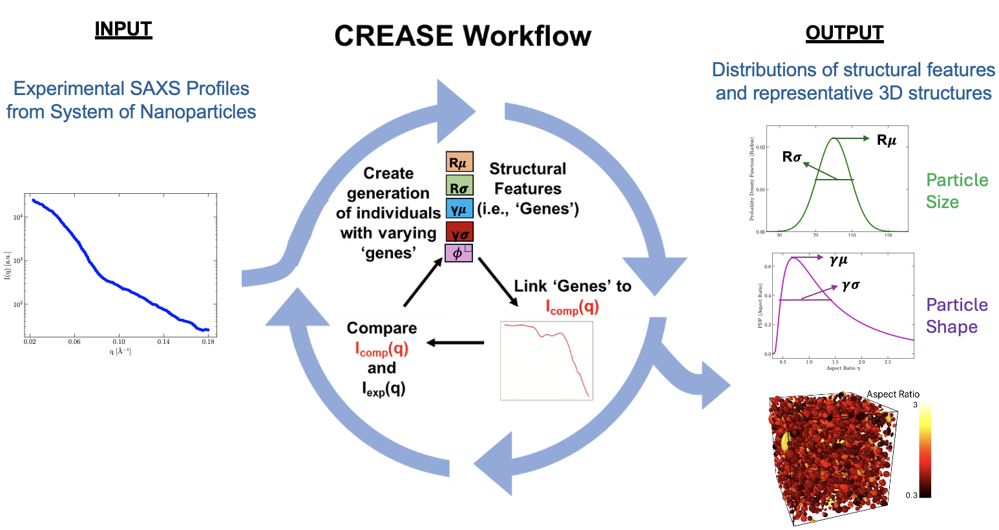
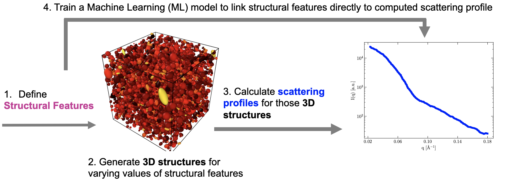
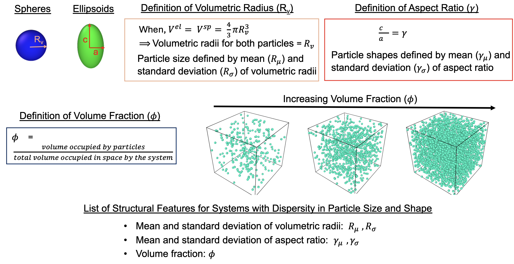
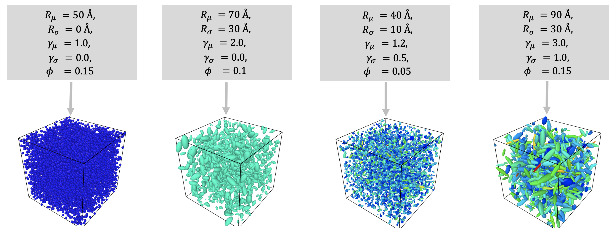
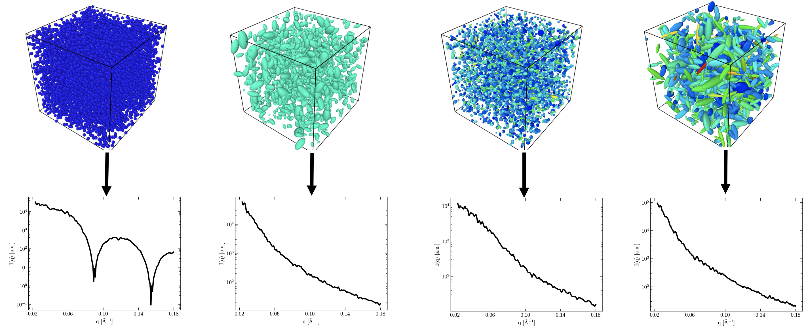
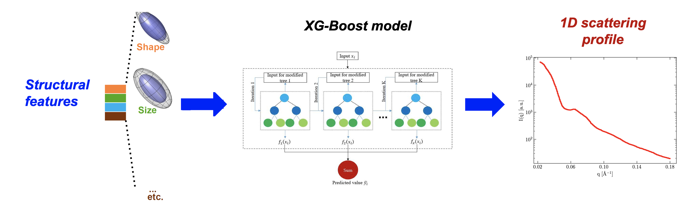

Case Study I: Analyzing Small Angle Scattering Profiles (1D) from Soft Materials with Dispersity in Particle Size and Shapes using CREASE
=======================================================================================================================================

In this case study, we use the CREASE method to analyze the dispersity in both the size and shapes of nanoparticles from their 1D scattering profile. The CREASE method as used in this study is pictorially represented in **Figure 1**.

   Figure 1.: The CREASE method to analyze the dispersity in size and shape of nanoparticles from their 1D scattering profiles.

A computational method that seeks to analyze the dispersity in both the size and shape simultaneously must have the ability to output multiple solutions. This has traditionally been a challenge for analytical models. The CREASE genetic algorithm outputs multiple solutions to an input scattering profile and ranks them according to their fitness. Hence it is capable of analyzing the dispersity in both the size and shapes of nanoparticles simultaneously. Below we walk you through the 4 steps involved in training a Machine Learning (ML) model that links the structural features of a nanoparticle system (with dispersity in both the size and shape) directly to its 1D scattering profile. The 4 steps are shown in **Figure 2**.

   Figure 2.: The four steps involved in training an XGBoost Machine Learning (ML) model that directly links a set of structural features to its computed scattering profile. The trained XGBoost model can later be incorporated into CREASE.

Once the ML model is trained, it can be incorporated into the CREASE loop. In this case, CREASE takes a 1D scattering profile as an input and outputs multiple sets of structural features whose computed scattering profiles closely match the input scattering profile.        

Step 1: Identifying the Structural Features of the System  
----------------------------------------------------------

The first step in training an ML model (that is to be incorporated in the CREASE loop) is the identification of structural features that are relevant to the system. In this study, the size of a nanoparticle is defined by its volumetric radius. Therefore, the structural features that capture the size distribution of the nanoparticle system are the mean and standard deviation of the volumetric radii. We define the shape of a nanoparticle by its aspect ratio. Therefore, the structural features that capture the shape distribution of the nanoparticle system are the mean and standard deviation of the aspect ratios. We define an additional structural feature, volume fraction, that defines the degree of packing of nanoparticles. **Figure 3** provides a pictorial description of the structural features identified for this study.   

   Figure 3.: Definitions of structural features relevant to this case study. Structural features are a set of physical descriptors that fully define a 3 dimensional (3D) structure of the system. For a system of nanoparticles with dispersity in both size and shape, we identify a set of five structural features as shown above.    

During this step it is important to spend some time and think about the expected output from CREASE. The final output from CREASE is going to be multiple sets of structural features that are identified in this step.         

Step 2:	Generating 3D Structures for Varying Values of Structural Features
----------------------------------------------------------------------------
In step 2, we generate 3000 3D structures by varying the structural features defined in the previous step. For this study, the mean volumetric radius of the system was varied uniformly in the range of 20-100 Angstroms. The standard deviation of the volumetric radii was varied uniformly to lie between 0-50% of the mean volumetric radii. The mean aspect ratio of the system was varied uniformly between 0.8-4.0. The standard deviation of the aspect ratio was between 0-50% of the mean aspect ratio. Volume fraction was uniformly varied in the range of [0.05, 0.15]. The range of variation of structural features is determined by manual matching. Manual matching (also known as sensitivity analysis) is carried out before a large scale generation of 3D structures to ensure that the features present in experimental scattering profiles are also seen in the computed scattering profiles for the range of structural features chosen. Manual matching is also necessary to ensure that the structural features in the chosen range have a noticeable effect on the computed scattering profiles. 4 out of the 3000 sets of structural features and their corresponding 3D representations are shown in **Figure 4**.   

   Figure 4.: Shows four 3 dimensional (3D) structures generated using the CASGAP **[1]** program. The 4 sets of structural features that were input to CASGAP to obtain the 3D structures are also shown. 

To generate representative 3D structures by using sets of structural features as an input, we use the CASGAP **[1]** program developed in the Jayaraman lab. CASGAP generates 3D structures of nanoparticles for a user defined distribution of particle size and shapes. The orientation of the nanoparticles can also by controlled by the user with a kappa (anisotropy) parameter. In this study, the kappa parameter was set to 0 for all 3D structures which represents completely disordered nanoparticle orientations.  

Step 3:	Calculating Scattering Profiles for the 3D Structures Generated
---------------------------------------------------------------------

In this step we use the database of 3000 3D representations that were generated in the previous step and compute a scattering profile corresponding to each 3D representation. For this study, a scattering code written in the Jayaraman lab was used to compute the scattering profile for each case using the scattering equation. The scattering profiles are computed from the amplitudes (complex variable) of the nanoparticle system instead of relying on the older Debye representation of the scattering equation. The calculation of the complex amplitudes from the coordinates of the nanoparticle system is a single summation and can hence be parallelized much more effectively (makes the code computationally faster) compared to the Debye representation, which is a double summation and hence cannot be parallelized. **Figure 5** shows 4 scattering profiles out of the 3000 computed in this study and their corresponding 3D representations.        

Figure 5.: Shows four computed scattering profiles and their corresponding 3 dimensional (3D) structures. The scattering profiles were computed from the 3D structures using a physics based equation. 

The scattering computation for each 3D representation is carried out 10 times by displacing the origin of the nanoparticle system randomly. This step is carried out to smoothen the computed scattering profile. For this study 931 q values in the range of 0.02-0.2 Angstrom^-1 are chosen based on experimental data. The scattering intensities are computed in 180 directions and azimuthally averaged to obtain 1D scattering profiles.   

Step 4.	Training a Machine Learning Model that Directly Links Structural Features to the Computed Scattering Profiles
----------------------------------------

At the end of step 3, we have 3000 sets of structural features and their corresponding computed profiles. In this step we train an XGBoost ML model to directly link a set of structural features to its computed scattering profile. Making use of this XGBoost model in CREASE means that CREASE iterates over the structural features of the system instead of 3D structures themselves, this makes CREASE much faster computationally. Out of the 3000 samples of nanoparticle systems studied, 2400 are chosen randomly to train the ML model. The other 600 samples are used as a test dataset for model validation. A csv file is created on python for the training dataset, each row of the file lists the values of the five structural features, the q value and I(q). The training dataset contains 2234400 (2400 samples * 931 q values) rows of data. The test dataset contains 558600 (600 samples * 931 q values) rows of data. The hyperparameters of the XGBoost ML model are tuned by Bayesian optimization using scikit packages on python. **Figure 6** is a pictorial representation of the ML model training.    

Figure 6.: Graphical representation of training an XGBoost Machine Learning (ML) model to directly link the structural features of a nanoparticle system to its computed scattering profile. 80% of the scattering profiles computed in step 3 are selected randomly and used as a training dataset for the ML model. The predictions of the ML model are validated by using the remaining 20% of the dataset (test dataset).

After the hyperparameters are tuned, the XGBoost ML model is saved and validated on the test dataset using the Mean Squared Error (MSE) and R2 metrics. The MSE and R2 values for the 600 test samples are comparable to the MSE and R2 for the 2400 training samples, this indicates that the ML model has been trained accurately. All of the computational codes for steps 1 through 4 were written in the Jayaraman lab and are similar to the open source computational codes provided as a part of the **CREASE-2D [2]** work.   

Incorporating the Trained ML Model in CREASE to Analyze the Dispersity in the Size and Shapes of Nanoparticles from their Experimental Scattering Profile
----------------------------------------

The XGBoost ML model can now be incorporated into the CREASE genetic algorithm (GA). CREASE is used in this study to analyze the dispersity in size and shape of nanoparticles that leads to featureless experimental scattering profiles collected by our collaborators at the Brookhaven National Laboratory (BNL). In this study, each generation of CREASE has 100 individuals (sets of structural features) whose computed profile best matches the input experimental profile. CREASE ranks the 100 individuals in decreasing order based on the fitness of the computed scattering profile to the input experimental profile. The choice for the number of generations in the CREASE loop is based on the convergence of the fitness of the GA individuals between one generation to the next. For this study we used 200 CREASE generations.

.. figure:: CasestudyI_Results_Expdata_hidden.png
   :class: with-border 

Figure 7.: CREASE predictions for the distribution of size and shapes of nanoparticle systems for 10 featureless scattering profiles collected at the Brookhaven National Laboratory. For each structural feature, the range of variation between the individuals of the genetic algorithm (last generation) are also plotted.

After 200 generations, the CREASE GA outputs 100 sets of structural features for each input experimental profile and ranks them based on their fitness. It is therefore straight forward to obtain a range of variation for each structural feature, which is an advantage of CREASE compared to analytical models. The range of structural features output by CREASE for 10 experimental profiles is shown in **Figure 7**. CREASE provides a range for the distribution of nanoparticle size and shapes for each experimental profile. This helps in analyzing the size and shape dispersity of the nanoparticles.   

References
__________

#.
   Gupta, N.; Jayaraman, A., *Computational approach for structure generation of anisotropic particles (casgap) with targeted distributions of particle design and orientational order*,
   **Nanoscale, 2023, 15.36, 14958-14970**. (`link <https://doi.org/10.1039/D3NR02425C>`_)

#.
   Akepati, S. V. R.;  Gupta, N.; Jayaraman, A., *Computational Reverse Engineering Analysis of the Scattering Experiment Method for Interpretation of 2D Small-Angle Scattering Profiles (CREASE-2D).* 
   **JACS Au 2024, 4, 1570-1582.** (`link <https://pubs.acs.org/doi/10.1021/jacsau.4c00068>`_)

