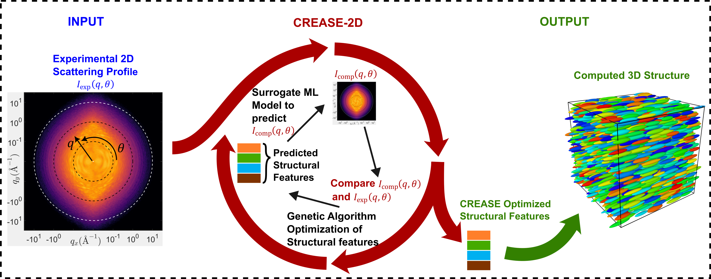
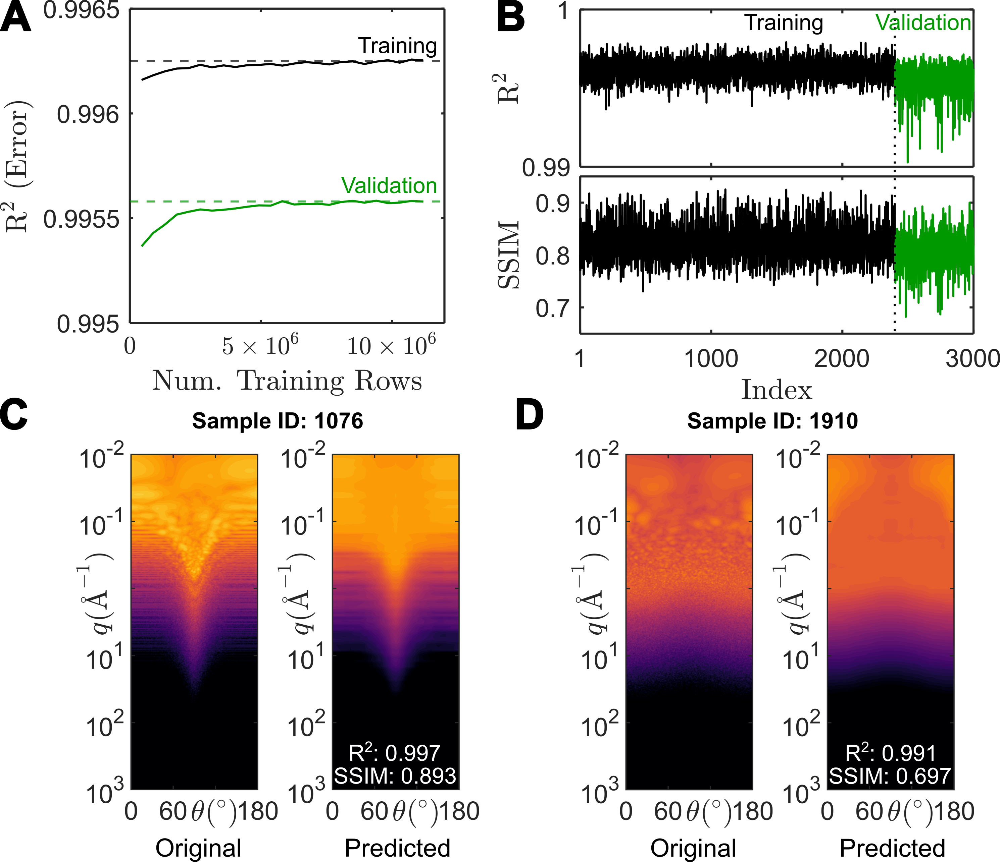
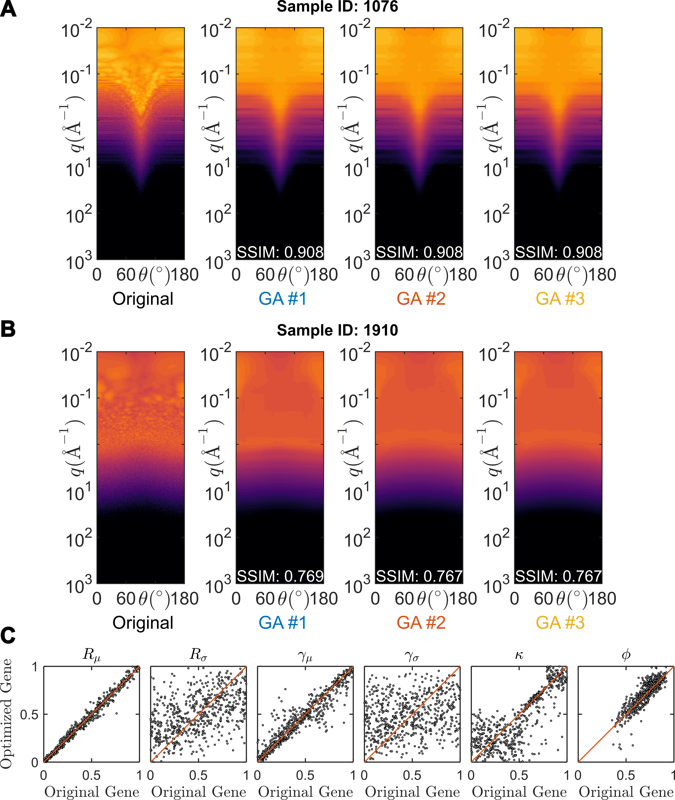

`Case Study II: Analysis of 2D scattering profiles for *in silico* system of spheroidal particles with dispersities in shapes, sizes and orientational order using CREASE-2D <https://github.com/arthijayaraman-lab/CREASE-2D>`_
===========================================================================================================================================================================
CREASE-2D codes and Tutorial Notebooks are provided here: https://github.com/arthijayaraman-lab/CREASE-2D

This case study showcases the implementation of CREASE-2D workflow for an *in silico* system of spheroidal particles as discussed in the original manuscript for CREASE-2D [1]. Please refer to the original manuscript for pertinent details about the method. In Figure 1 the CREASE-2D workflow applied to the *in silico* system of spheroidal particles is briefly reviewed, with input obtained as a 2D experimental scattering profile encoding information about spheroidal particles' form and structural arrangement. CREASE-2D uses a Genetic Algorithm (GA) optimizer to find the sets of structural features that can closely characterize the experimental input. The CREASE-2D workflow uses a surrogate Machine Learning (ML) model to predict computed 2D scattering profiles in a time- and memory-efficient manner. Thus, the implementation of the CREASE-2D workflow for any system of interest can be carried out by following the 4 steps as demonstrated below.

   Figure 1.: CREASE-2D workflow used to analyze the system of *in silico* spheroidal particles. The input is the 2D scattering profile generated from the 3D *in silico* structures with a predefined set of structural features. Only the “experimental: 2D scattering profile, :math:`I_{exp}(q,\theta)` where :math:`q` is magnitude of scattered wavevector and :math:`\theta` is the azimuthal angle, is used as the input to the CREASE-2D method. The GA optimizes toward structural features whose :math:`I_{comp}(q,\theta)` closely resembles :math:`I_{exp}(q,\theta)`. Figure adapted from reference [1].

Step 1: Structural Feature Identification And Structure Generation
------------------------------------------------------------------

The first step involves proper identification of all numerical parameters that have a unique and non-trivial effect on the scattering profiles. Currently, the *in silico* system of spheroidal particles has been characterized by 6 structural features, namely :math:`R_\mu`, :math:`R_\sigma`, :math:`\gamma_\mu`, :math:`\gamma_\sigma`, :math:`\kappa` and :math:`\phi`. Some relevant details about the identified structural features are provided below and more detailed information can also be found in references [1] and [2].

#. :math:`R_\mu` and :math:`R_\sigma` represent the mean and standard deviation in the volumeteric radius of the spheroidal particles (a measure of their size) following a log-normal distribution.

#. :math:`\gamma_\mu` and :math:`\gamma_\sigma` represent the mean and standard deviation in the spheroidal aspect ratio of the particles, a parameter that directly influences the shape of the particles, also following a log-normal distribution.

#. The orientation of particles is specified by the 3D vector pointing along the major axis of the spheroid. The distribution of orientation follows the 3D von Mises–Fisher (vMF) distribution. Here the mean orientation has been fixed to one of the axes in the laboratory frame (as explained in the manuscript) and the extent of the orientational order is characterized by the :math:`\kappa` parameter, which is a measure of the inverse dispersity in orientation. :math:`\kappa=0` indicates complete lack of the orientational order (isotropic) and :math:`\kappa\rightarrow\infty` indicates perfect orientational order (highly anisotropic). 

#. The concentration of particles is quantified by the volume fraction of particles, :math:`\phi`. This parameter is not independently controlled and is evaluated after the CASGAP method generates a structure with the specified distributions of shape, size and orientational order.

Using the defined structural features a dataset of 3000 structural features was first generated. We used the CASGAP method [2] (which stands for Computational Approach for Structure Generation of Anisotropic Particles) to generate these structures. The CASGAP method was developed primarily to generate overlap-free configurations of spheroidal particles with pre-defined distributions of shapes, sizes and orientational order. The identified structural features and some representative structures are depicted in Figure 2.

.. figure:: case_study_2_files/Figure2_Step1.png
   :class: with-border
   :width: 900px

   Figure 2.: **(A)** Identified structural features for the *in silico* system. **(B-D)** Representative snapshots of 3D structures displaying variations in size, shape and orientational order, respectively. Figure adapted from reference [1].

**Important Note**: CREASE-2D has recently been extended to work with structures that can entirely be defined by uniformly-distributed point scatterers. This makes the method more adaptable to any general structural configuration (not just spheroids). Step 1 can therefore be adapted to include any system with structural features that are either predefined or identified (through sensitivity analysis). The only requirement would be to have a computational method (similar to CASGAP) that generates a 3D structure (uniformly filled with point scatterers) using the defined or identified structural features.

Step 2:	Calculation of Scattering Profiles
------------------------------------------

For each of the generated structures in Step 1, 2D scattering intensity :math:`I(q,\theta)` is computed by first computing the scattering amplitude :math:`A(q,\theta)`. Calculation of scattering amplitude can be parallelized over multiple cpus or gpus, as it doesn't involve pairwise computations, and only requires a single summation term over the entire list of scatterers. In Figure 3, the results of such calculations for selected samples of the current *in silico* system are shown. Here two forms of the scattering profile are displayed. The polar form may be more familiar to experimental users, and is typically how scattering profiles are measured at small angle scattering facilities. However, the cartesian form of the 2D scattering intensity :math:`I(q,\theta)` closely resembles the matrix type of data structure that is easier to manipulate for data processing and ML training in Step 3.

.. figure:: case_study_2_files/Figure3_Step2.png
   :class: with-border
   :width: 900px

   Figure 3.: Calculated 2D scattering profiles in cartesian (center) and polar (right) form for representative structures (left) shown for a few samples. Figure adapted from reference [1].

Step 3:	Training of Surrogate Machine Learning Model to Predict Scattering Profiles from Structural Features
------------------------------------------------------------------------------------------------------------

Currently CREASE-2D implementation uses XGBoost as the ML model due to its exceptional performance and lower scope of overfitting. The data set of 3000 2D scattering profiles and their corresponding structural features is first split such that 80% of the data (2400 structures) is used for training the ML model and the remaining 20% (600 structures) is used for testing/validation of the ML model’s performance.

To use XGBoost, the training data set is reformatted into a table, with each row containing all 6 structural features as well as, three new fields corresponding to :math:`q`, :math:`\theta` and :math:`I(q,\theta)`. The last three fields can be obtained by serializing the cartesian form of the 2D scattering profiles, after appropriate subsampling (to avoid excessive data for efficient memory usage; please see main manuscript [1] for more details).

Before final training of the XGBoost model, its hyperparameters must be optimized or tuned for optimum performance (details provided in the main manuscript [1]). Using the tuned hyperparameters, the trained model for the current dataset shows good learning behavior and performance for both training and validation datasets as shown in Figure 4. 

   Figure 4.: **(A)** Learning curve during training of XGBoost model, using R\ :sup:`2` error for both the training (black) and validation (green) data entries. **(B)** Performance of the XGBoost model using the R\ :sup:`2` and the structural similarity index measure (SSIM) scores for all 3000 samples in the data set. (C,D) Original and predicted scattering profiles for a selected few samples from the validation data set, each marked with their R\ :sup:`2` and SSIM scores. Figure adapted from reference [1].

Step 4:	Incorporating the Surrogate ML Model within the Genetic Algorithm (GA) Optimization Loop to Complete CREASE-2D Workflow
-------------------------------------------------------------------------------------------------------------------------------
The final step in CREASE-2D implementation is to put together the predictive capacity and the speed of the surrogate ML model within the GA optimization loop. The input to the GA is an *in silico* "experimental" 2D scattering profile (:math:`I_{exp}(q,\theta)`), which is compared to the ML predicted or "computed" 2D scattering profile (:math:`I_{comp}(q,\theta)`).

Consequently, the 6 structural features are represented as 6 corresponding "genes", which are additionally normalized to the interval 0-1. For every “individual” with a unique set of genes, :math:`I_{comp}(q,\theta)` is predicted from the surrogate ML model using the individual’s structural features as the input. All individuals in each generation are then ranked by their “fitness” value which is quantified by the SSIM of the individual’s :math:`I_{comp}(q,\theta)` with respect to the :math:`I_{exp}(q,\theta)`. The objective of the GA optimization loop is to improve the fitness of an individual; in other words, improvement of the SSIM score of its computed scattering profile :math:`I_{comp}(q,\theta)` as compared to :math:`I_{exp}(q,\theta)`.

In Figure 5 we see that for three independent GA runs, CREASE-2D obtains very close matches to the input 2D scattering profiles for both the 2 examples. Comparing the overall performance for all test samples, CREASE-2D is able to identify :math:`R_\mu`, , :math:`\gamma_\mu`, :math:`\kappa` and :math:`\phi` to a greater degree of accuracy. However, :math:`R_\sigma` and :math:`\gamma_\sigma` are not identified with enough precision because those structural features were not too sensitive to the scattering profiles in the dataset.

   Figure 5.: **(A,B)** Two selected samples show visual comparison of the input scattering profile and outputs from three independent GA runs. **(C)** The comparison of GA-optimized values of the normalized “gene” or structural features and the original value of the structural feature, normalized to represent a target gene value for all 600 samples tested with CREASE-2D. Figure adapted from reference [1].

References
----------
#. Akepati, S. V. R.;  Gupta, N.; Jayaraman, A., *Computational Reverse Engineering Analysis of the Scattering Experiment Method for Interpretation of 2D Small-Angle Scattering Profiles (CREASE-2D).* 
   **JACS Au 2024, 4, 1570-1582.** (`link <https://pubs.acs.org/doi/10.1021/jacsau.4c00068>`_)

#. Gupta, N.; Jayaraman, A., *Computational approach for structure generation of anisotropic particles (casgap) with targeted distributions of particle design and orientational order*,
   **Nanoscale, 2023, 15.36, 14958-14970**. (`link <https://doi.org/10.1039/D3NR02425C>`_)

