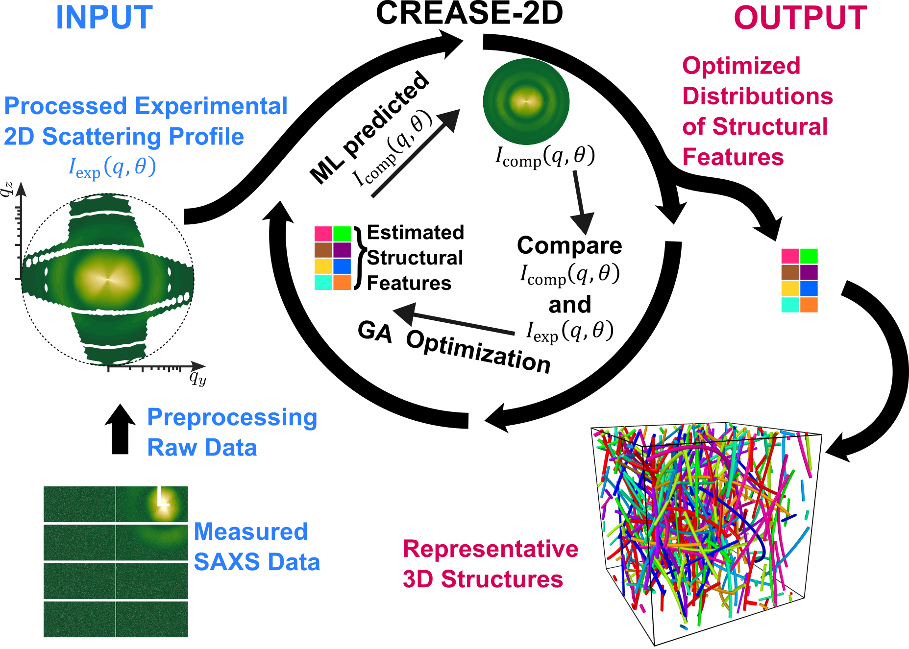
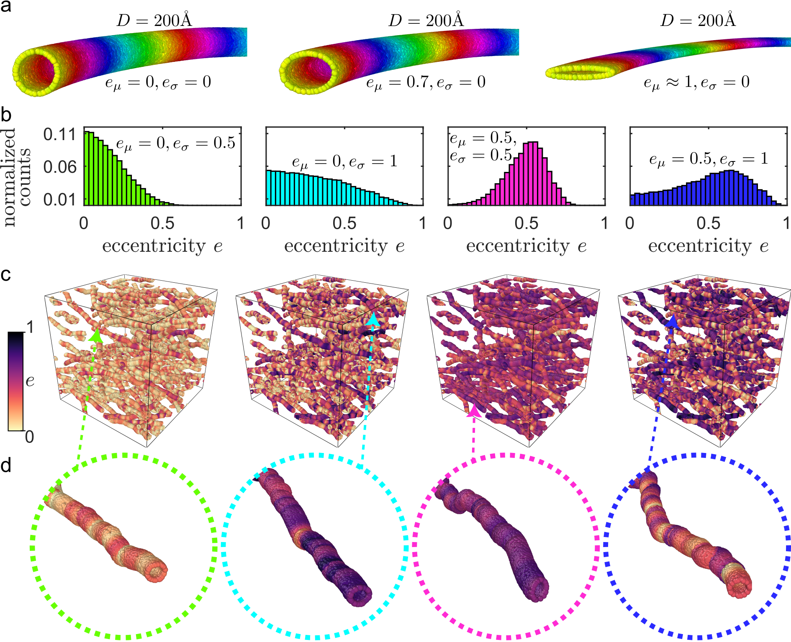
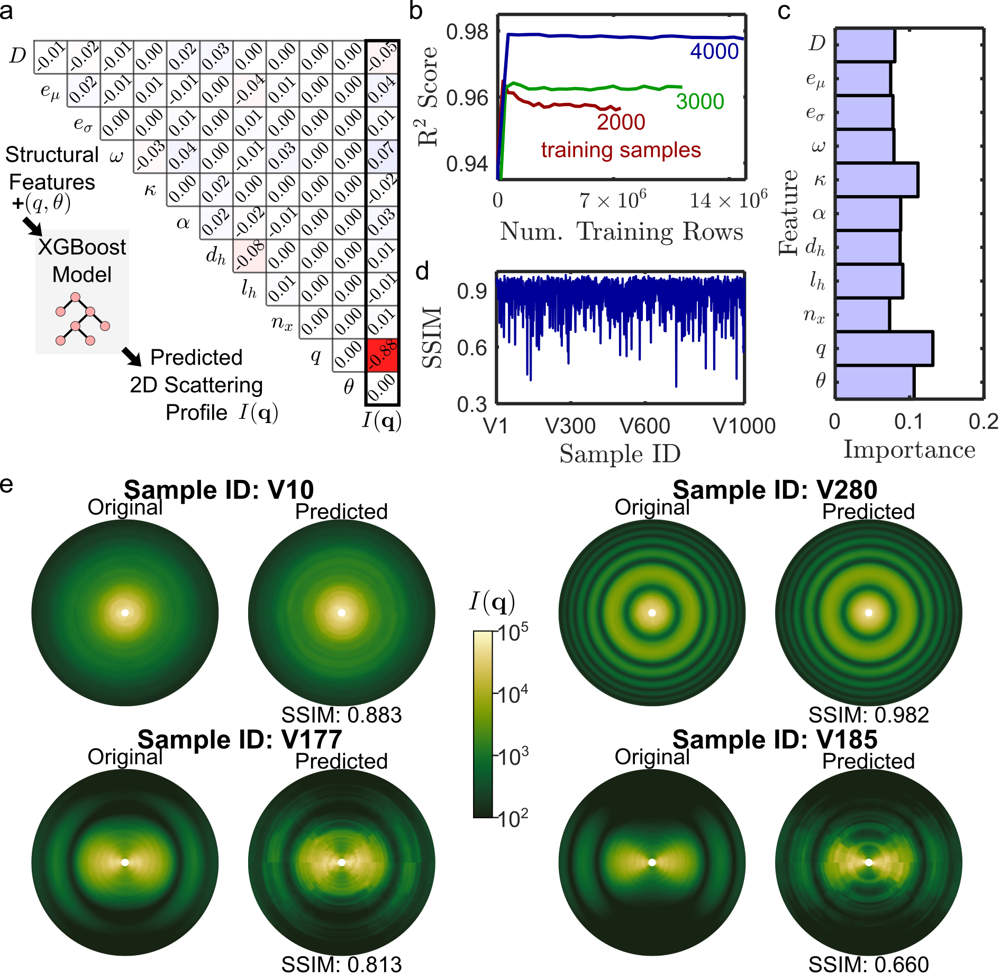
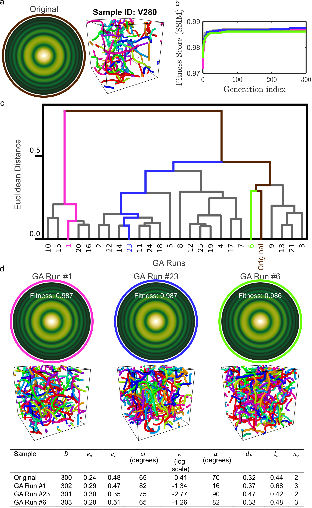
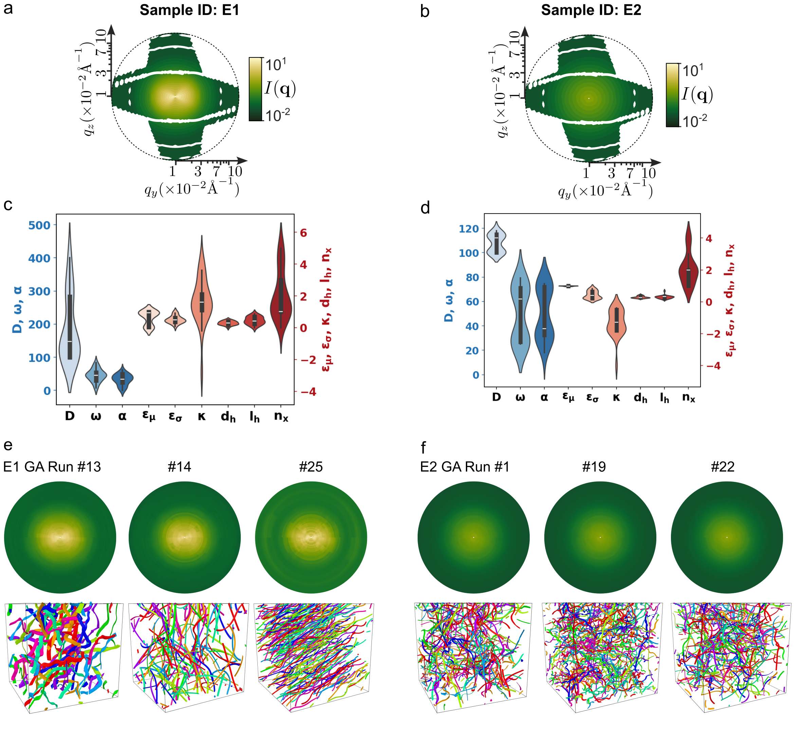

`Case Study III: Analysis of Experimental 2D Scattering Profiles of Dipeptide Nanotubes with Varying Cross-Sectional Eccentricity <https://github.com/arthijayaraman-lab/CREASE-2D-Analysis-of-2D-SAXS-Profiles-to-Characterize-Anisotropic-Nanostructures-in-soft-materials>`_
===========================================================================================================================================================================

In this case study, CREASE-2D is applied to analyze experimental 2D small-angle X-ray scattering (SAXS) profiles of supramolecular dipeptide nanotubes to infer structural features such as tube diameter, cross-sectional eccentricity, orientation angle, and orientational anisotropy directly from the full 2D intensity :math:`I_{exp}(q,\phi)` . The goal is to obtain statistically meaningful distributions of these structural features such as tube diameter, mean and standard deviation of cross-sectional eccentricity, orientation angle, anisotropy from the experimental scattering data using the CREASE-2D method.

   Figure 1: CREASE-2D workflow used to analyze nanotube systems. The input is the "experimental: 2D scattering profile, :math:`I_{exp}(q,\phi)` where :math:`q` is magnitude of scattered wavevector and :math:`\phi` is the azimuthal angle. The genetic algorithm (GA) optimizes structural features whose :math:`I_{comp}(q,\phi)` closely resembles :math:`I_{exp}(q,\phi)`.

This case study follows the CREASE-2D tutorial described by Jayaraman Lab ("Tutorial: Machine-Learning-Based CREASE-2D Analysis of 2D SAXS Profiles to Characterize Anisotropic Nanostructures in Soft Materials", ACS Measurement Science Au, 2025, DOI: 10.1021/acsmeasuresciau.5c00141). The tutorial explains steps to interpret small angle scattering profiles, CREASE-2D implementation, best practices, and explains a case study applying CREASE-2D to experimental 2D SAXS data from dipeptide solutions and provides a complete, step-by-step demonstration of the workflow for experimental data. Key elements emphasized in the tutorial include:

- Preprocessing of 2D SAXS data to handle missing pixels, apply inversion symmetry, and reduce noise by smoothing and masking.
- Selection of a set of structural features tailored for tubular assemblies (e.g., tube diameter D; cross-sectional eccentricity mean e_mu and dispersity e_sigma; mean orientation ω and orientational anisotropy κ; tortuosity descriptors α, d_h, l_h, n_x; and intensity scaling parameters a and b).
- Generation of 3D scatterer-based structures, computation of 2D scattering I(q,\phi) from those structures.
- Training a surrogate forward ML model (XGBoost) to predict 2D scattering from structural features, and embedding that surrogate within a GA optimization loop that uses SSIM as a fitness metric to infer structural features consistent with experimental SAXS.

The tutorial further demonstrates uncertainty quantification and multiple-solution analyses by running many (e.g., 25) GA trials and visualizing results with violin plots and dendrograms; it also provides open-source code and supporting data on GitHub <https://github.com/arthijayaraman-lab/CREASE-2D-Analysis-of-2D-SAXS-Profiles-to-Characterize-Anisotropic-Nanostructures-in-soft-materials>.

1: Structural Features Identification And Structure Generation
------------------------------------------------------------------

The first step involves identifying structural features that capture the physical hypotheses for assembled dipeptide tubes. For the dipeptide SAXS case study, we selected a set of structural features tailored to tubular geometries, tortuosity, and orientational order. These features are:

#. D — the circular tube diameter.

#. e_mu — the mean cross-sectional eccentricity (0 = circular, 1 = flat ribbon), describing the ellipticity of tube cross sections.

#. e_sigma — the normalized standard deviation of cross-sectional eccentricity (a unitless measure between 0 and 1 that quantifies dispersity in eccentricity along and between tubes).

#. ω — the mean orientation angle (in-plane angle describing mean tube alignment, used together with image rotation of the experimental pattern to remove in-plane degeneracy).

#. κ — the orientational anisotropy parameter that quantifies alignment via the von Mises–Fisher (vMF) distribution (high κ → strong alignment; κ≈0 → isotropic).

#. α — herd cone angle, controls the angular spread between connected herding tubes (0° = straight; up to 90° = highly tortuous).

#. d_h — diameter of each herding tube (controls local node placement and effective stiffness of the backbone).

#. l_h — length of the herding tube (controls contour length scale over which nodes are placed).

#. n_x — number of extra nodes in each herding tube (controls curvature localization and flexibility along the backbone).

In addition to these nine structural features that describe the tube geometry and organization, we also include two empirical intensity parameters when fitting experimental SAXS: a (linear scaling) and b (positive offset) that account for intensity normalization and background differences between computed and experimental intensities. When optimizing experimental samples the GA therefore typically optimizes 11 parameters (9 structural + a and b).

Using the defined structural features we generate 3D structures as shown in Figure 2(c), For the dipeptide case study, 5000 samples were generated and split into 4000 training and 1000 validation samples. Structure generation adapts the CASGAP approach to build tubular geometries via connected "herding" tubes and point-scatterer shells (hollow tubes filled with uniformly distributed point scatterers) so that the resulting structures faithfully capture variations in cross-sectional eccentricity, diameter, tortuosity, and orientation. 

   Figure 2.: (a) Representative snapshots of single tubes with same diameter but varying cross-section shape (i.e., varying mean eccentricity :math:`e_\mu` and zero dispersity :math:`e_\sigma = 0`). (b–d) Representative snapshots of systems with varying mean and standard deviation in eccentricity, :math:`e_\mu` and :math:`e_\sigma`, with (b) histograms of eccentricity, (c) complete snapshot of the dipeptide system, and (d) close-up of a single tube from the system. The color-bar on the left codes the varying cross-sectional eccentricity along the length as well as between different tubes in (c) and (d). 3D structures are visualized using OVITO. Figure adapted from reference [3].

2: Calculation of Scattering Profiles
------------------------------------------

For each of the generated structures, 2D scattering intensity :math:`I_{comp}(q,\phi)` is computed by first computing the scattering amplitude :math:`A(q,\phi)`. Calculation of scattering amplitude can be parallelized over multiple CPUs or GPUs, as it doesn't involve pairwise computations, and only requires a single summation term over the entire list of scatterers. 

:math:`I_\text{comp}(q,\phi) = \bigl|A(q,\phi)\bigr|^2`

where
.. math:: A_\text{comp}(q,\phi) = \sum_{j=1}^{N} \Delta\rho_j,v_j,f_j(q,\phi),\exp!\bigl(-i,\mathbf{q}\cdot\mathbf{r}_j\bigr),

where :math:`\Delta\rho_j` is the scattering length density contrast of scatterer :math:`j`, :math:`v_j` is its volume, :math:`f_j(q,\phi)` is its form factor, :math:`\mathbf{r}_j` is its position vector, and :math:`N` is the total number of scatterers.

3: Training of Surrogate Machine Learning Model to Predict Scattering Profiles from Structural Features
------------------------------------------------------------------------------------------------------------
We explain different ways to train a forward model in the tutorial. For this work, we trained XGBoost as the ML model to predict :math:`I_{comp}(q,\phi)` from structural features along with q and :math:`\phi` due to its exceptional performance and robustness on large tabular datasets.

Before final training of the XGBoost model, its hyperparameters must be optimized or tuned for optimum performance (details provided in the main manuscript [1],[3]). Using the tuned hyperparameters, the trained model for the current dataset shows good learning behavior and performance for both training and validation datasets as shown in Figure 3. 

   Figure 3.: (a) Learning curve during training of the XGBoost model where the size of the training dataset is varied between 2000, 3000 and 4000 samples. (b) Importance histogram for each input feature to the XGBoost model trained with 4000 samples. (c) Performance of the XGBoost models using the structural similarity index measure (SSIM) scores for all 1000 validation samples. (d) Original and predicted scattering profiles for a few samples (specified in Table 2) from the validation dataset with their SSIM scores indicating the quality of their match.

4: Incorporating the Surrogate ML Model within the Genetic Algorithm (GA) Optimization Loop for In Silico Validation
-------------------------------------------------------------------------------------------------------------------------------
We integrate the XGBoost surrogate model within Genetic Algorithm (GA) optimization loop to infer structural features from 2D scattering profiles. To validate the workflow, we first test the GA on computed 2D scattering profile :math:`I_{comp}(q,\phi)` for which we knew the original structural features. 
The GA begins by initializing a population of candidate solutions ("individuals"), where each individual represents a unique set of structural features. The 9 structural features are represented as 9 corresponding "genes", which are normalized to the interval 0–1. For every "individual" the surrogate ML model predicts the associated scattering profile :math:`I_{comp}(q,\phi)`. 
Individuals within a generation are then ranked on their "fitness", defined as the structural similarity index measure (SSIM) between the predicted :math:`I_{comp}(q,\phi)` and the targeted scattering profile :math:`I_{target}(q,\phi)`. The GA iteratively refines the population, with the objective of maximizing the SSIM score and thereby identifying structural features that yield scattering profiles closely matching the target. The GA employs selection, crossover, and mutation operations to explore the solution space effectively.

As shown in Figure 4, we run 25 GA runs, plot dendrograms and show three independent GA runs that has most diversity along with their 3D structures .

   Figure 4.: CREASE-2D performance for the Sample V280. (a) Original 2D scattering profile and structure of Sample V280. (b) Evolution of the best fitness individual during three independent GA runs. (c) Dendrogram of the 25 GA runs showing similarities and differences between the outputs of the 25 GA runs. (d) CREASE-2D output of GA Run #1, #23 and #6, with best fit scattering profiles, reconstructed 3D structures, and all their structural features. Among these chosen GA runs, #1 (magenta) and #23 (blue) are the most different based on the Euclidean distance between their predicted structural features. GA run #6 (green) structural features are the closest match to the original structural features. Color coding is used in (b), (c) and (d) to associate the plots with respect to 3 chosen GA runs in (d).

5: Application of CREASE-2D to Analyze Experimental 2D SAXS Profiles of Dipeptide Nanotubes
-------------------------------------------------------------------------------------------------------------------------------
We now apply the validated CREASE-2D workflow to analyze experimental 2D SAXS profiles E1 and E2. We also include two additional structural features a (scaling factor) and b (positive shift) to enable the quantitative comparison of intensity values of SAXS and the computed scattering profiles during the GA optimization loop. 

:math:`I_{comp_new}(q,\phi) = a\,I_{comp}(q,\phi) + b`

We present the optimized best set of structural features from 25 independent GA runs for both experimental samples E1 and E2 in Figure 5.

   Figure 5.: (a–b) Processed 2D SAXS profiles of E1 and E2 experimental data. (c–d) Violin plot for optimized structural features in E1 and E2 samples. (e–f) CREASE-2D output for E1 of GA Run #13, #14, #25, and E2 of GA Run #1, #19, #22, and their reconstructed 3D structures.
References
----------
#. Akepati, S. V. R.;  Gupta, N.; Jayaraman, A., *Computational Reverse Engineering Analysis of the Scattering Experiment Method for Interpretation of 2D Small-Angle Scattering Profiles (CREASE-2D).* 
   **JACS Au 2024, 4, 1570-1582.** (`link <https://pubs.acs.org/doi/10.1021/jacsau.4c00068>`_)

#. Gupta, N.; Jayaraman, A., *Computational approach for structure generation of anisotropic particles (casgap) with targeted distributions of particle design and orientational order*,
   **Nanoscale, 2023, 15.36, 14958-14970**. (`link <https://doi.org/10.1039/D3NR02425C>`_)

#. Akepati, S. V. R.; Gupta, N.; Jayaraman, A.; Shah, J.; Kronenberger, S.; Venkat, V.; Adhikari Sridhar, R.; Bianco, S.; Adams, D. J., *Tutorial: Machine-Learning-Based CREASE-2D Analysis of 2D SAXS Profiles to Characterize Anisotropic Nanostructures in Soft Materials.*
   **ACS Measurement Science Au, 2025.** (`link <https://doi.org/10.1021/acsmeasuresciau.5c00141>`_)

